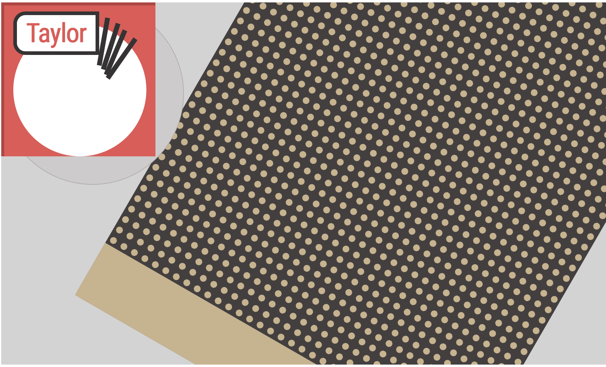

---
Still Life CSS
---

## Description.

With a team, an assemblage was constructed with various material to create a still life image. This image was 'creatively' reconstructed using pure CSS and html. This project demonstrates a working knowledge of CSS and HTML as well as basic design principles including framing, open-compositions, overlap and continuity, abstraction, etc. CSS animations were implemented throughout the page to create movement. 

## Viewing Still Life.

Open CodePen to view StillLife.html: https://codepen.io/namitasajai/pen/bGjxepP

## Contact Information.

Created by Namita Sajai, 2021

